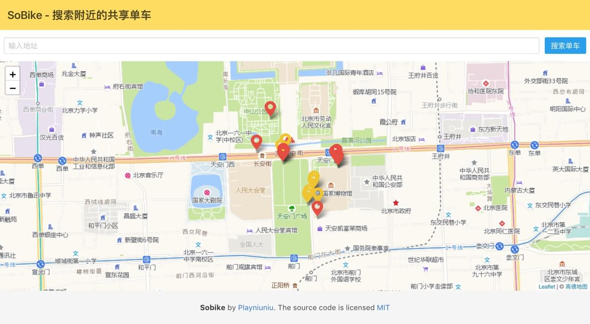

# Sobike - 搜索附近的单车网页版



[![Release][1]][2] [![MIT licensed][3]][4]

[1]: https://img.shields.io/badge/release-v0.1-brightgreen.svg
[2]: https://github.com/playniuniu/go-sobike/releases
[3]: https://img.shields.io/dub/l/vibe-d.svg
[4]: LICENSE

### Docker

```bash
docker run -t --name sobike -p 8080:8080 -d playniuniu/sobike-web
```

### 使用方法

```bash
sobike-web
```

或者

```
sobike-web -p 8080
```

### 开发者

GO Dep

```bash
go get github.com/fatih/color
go get github.com/sirupsen/logrus
go get github.com/julienschmidt/httprouter
```
